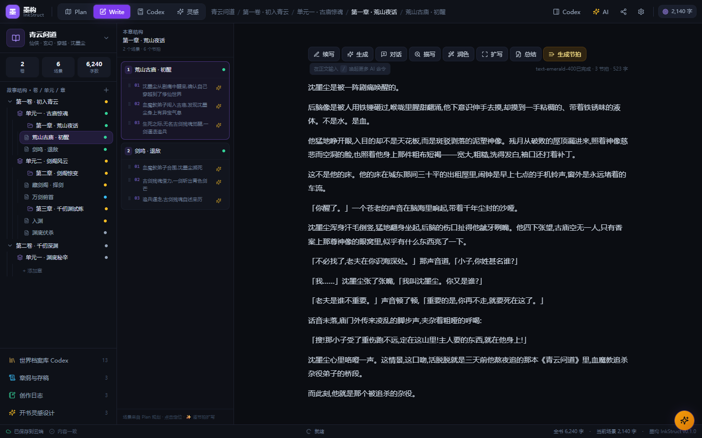
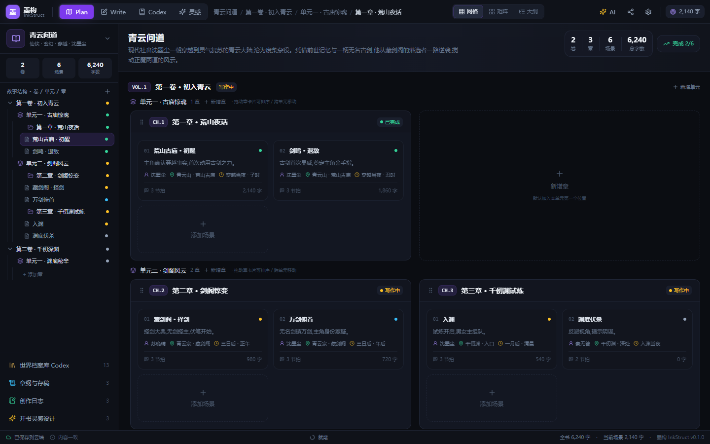
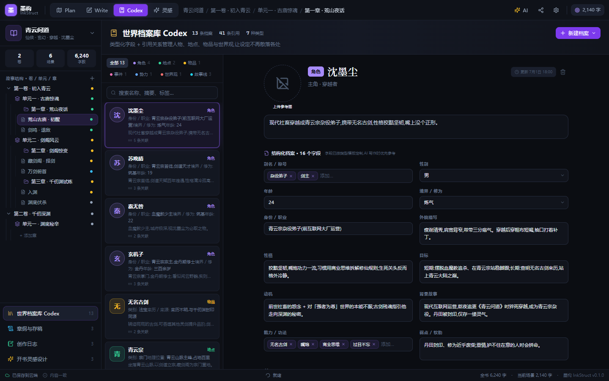

# 墨构 InkStruct

> **构世界，写长篇。**
> AI 网文创作工作台 · 从开书灵感到卷·单元·章·场景的结构化规划，再到沉浸写作与世界档案，一站式长篇网文创作平台。



---

## ✨ 核心特性

### 🎯 四大工作台 + 两大功能页

| 模块 | 功能 |
|---|---|
| **灵感助手** | 开书前故事设计台：盲盒抽卡 / 定向灵感 → 故事整体大纲走向 + 角色设计 → 一键导入 Plan |
| **Plan 规划** | 三视图（网格/矩阵/大纲）展示卷→单元→章→场景四层结构；支持章节拖拽排序与跨单元移动；场景可创建/编辑/删除 |
| **Write 写作** | 章级连续写作视图；contentEditable 富文本编辑器；AI 命令前置专业参数面板（长度/视角/文风/用户要求），不再一键空转 |
| **Codex 档案库** | 七类档案（角色/地点/物品/事件/势力/世界观/**故事线**），类型化字段 + 引用关系 + 参考图头像 |
| **章纲与存稿** | 逐章写大纲，按场景预览存稿，一键跳转写作 |
| **创作日志** | 每日字数记录，连续更新天数与累计统计 |

### 🧩 AI 命令专业参数化
- 输出长度（短/中/长/超长）
- 视角与人称（第三人称/第一人称）
- 文风（古风/现代/简洁/华丽/紧张/温情）
- 用户额外要求、参考内容预览
- 节拍生成专用：数量、节奏密度、关注点多选、流式预览、确认追加

### 🎨 世界观构建
- **故事线**档案：主线/感情线/支线/暗线，自动生成时间轴走向
- **参考图**：所有档案支持上传参考图，自动作为头像展示

### 📚 长篇结构
- **卷 → 单元 → 章 → 场景** 四层结构，专为长篇连载设计
- 创作日志：连续天数与每日字数统计
- 多项目管理：localStorage 持久化，刷新不丢

---

## 🖼 工作台预览

<div align="center">
  
  
  
  <br/>
  <sub>Plan · Write · Codex 三大核心工作台</sub>
</div>

---

## 🚀 快速开始

### 环境要求
- Node.js ≥ 18
- npm / pnpm / yarn

### 安装与启动

```bash
# 克隆
git clone https://github.com/liu183/inkstruct.git
cd inkstruct

# 安装依赖
npm install

# 启动开发服务器
npm run dev
# → http://localhost:5173

# 构建生产版本
npm run build

# 预览生产版本
npm run preview
```

### 接入真实大模型（可选）

当前 AI 引擎为内置流式打字机模拟器。要接入真实 LLM，只需替换 `src/utils/aiEngine.ts` 中的 `streamAIText` 异步生成器：

```typescript
export async function* streamAIText(ctx: AIGenContext): AsyncGenerator<string> {
  // CodeBuddy Agent SDK
  const stream = query({ prompt: buildPrompt(ctx), options: { model: 'claude-sonnet-4' } });
  for await (const chunk of stream) yield chunk.text;

  // 或任意 OpenAI 兼容 API + SSE
  const res = await fetch('/api/chat', { /* ... */ });
  // 解析 SSE 流并 yield
}
```

**上下文 (`AIGenContext`) 已包含** `length / povTense / style / userHint / beatCount / beatDensity / beatFocus` 等专业参数，可直接组装为 prompt。

---

## 🛠 技术栈

- **React 18** + **TypeScript** — 类型安全
- **Vite 5** — 构建与开发服务器
- **Tailwind CSS 3** — 原子化样式
- **Zustand 4** — 状态管理 + localStorage 持久化
- **Lucide** — 图标库

---

## 📁 项目结构

```
inkstruct/
├── docs/                  # README 产品截图
├── src/
│   ├── components/
│   │   ├── ai/            # AI 助手面板
│   │   ├── codex/         # 世界档案库（档案 + 头像组件）
│   │   ├── drafts/        # 章纲与存稿工作台
│   │   ├── inspiration/   # 开书灵感设计台（盲盒/定向/故事设计）
│   │   ├── journal/       # 创作日志工作台
│   │   ├── layout/        # 顶栏/侧边栏/状态栏
│   │   ├── plan/          # Plan 规划（网格/矩阵/大纲三视图）
│   │   ├── project/       # 项目管理（新书增删改查）
│   │   ├── settings/      # 设置弹窗
│   │   ├── share/         # 分享与导出
│   │   └── write/         # Write 写作工作台
│   ├── data/              # 种子数据 + 命令注册 + 题材档案
│   ├── hooks/             # React Hooks
│   ├── store/             # Zustand store（项目/卷/单元/章/场景）
│   ├── types.ts           # 全局类型定义
│   └── utils/             # 工具函数（AI 引擎、图片压缩、四层遍历）
├── index.html
├── package.json
├── tailwind.config.js
├── tsconfig.json
└── vite.config.ts
```

---

## 🗺 路线图

- [x] 卷 / 单元 / 章 / 场景四层结构
- [x] 项目增删改查与持久化
- [x] 灵感设计与故事大纲自动生成
- [x] 世界档案库 + 参考图头像
- [x] 创作日志
- [x] AI 专业参数化（不再一键空转）
- [x] 三视图规划
- [ ] 多用户协作
- [ ] 云端同步与分享链接
- [ ] 导入/导出 EPUB
- [ ] 全局搜索与按标签过滤
- [ ] 真实 LLM 接入示例

---

## 📜 许可

仅供个人学习与作品创作使用。

---

<div align="center">
  <sub>用 ❤️ 与 React 18 + TypeScript + Vite 构建 · 品牌：墨构 InkStruct</sub>
</div>